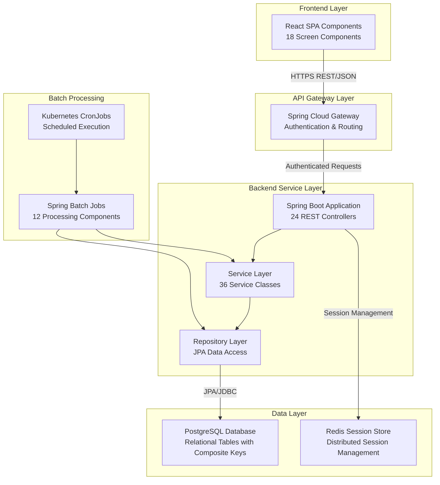

# CardDemo Backend Service

A comprehensive Spring Boot backend service representing the complete modernization of the legacy CardDemo mainframe application from COBOL/CICS/VSAM to Java 21/Spring Boot/PostgreSQL architecture. This service maintains 100% functional parity with the original system while providing cloud-native scalability and maintainability.

## Table of Contents

- [Overview](#overview)
- [Architecture](#architecture)
- [Technology Stack](#technology-stack)
- [Project Structure](#project-structure)
- [Getting Started](#getting-started)
- [Database Schema](#database-schema)
- [API Endpoints](#api-endpoints)
- [Spring Batch Jobs](#spring-batch-jobs)
- [Security Configuration](#security-configuration)
- [Session Management](#session-management)
- [Deployment](#deployment)
- [Monitoring and Observability](#monitoring-and-observability)
- [Migration Guide](#migration-guide)
- [Development Guidelines](#development-guidelines)
- [Troubleshooting](#troubleshooting)

## Overview

### Migration Scope

This Spring Boot backend service represents the complete transformation of 36 COBOL programs (24 CICS interactive + 12 batch) into modern Java microservices while preserving exact business logic and data processing patterns. The migration encompasses:

- **Interactive Programs**: 24 CICS transaction programs converted to REST controllers
- **Batch Programs**: 12 JCL batch jobs converted to Spring Batch jobs
- **Data Access**: VSAM KSDS datasets migrated to PostgreSQL relational tables
- **User Interface**: BMS mapsets replaced with React SPA communication
- **Security**: RACF authentication/authorization replaced with Spring Security

### Core Principles

- **Minimal Change Approach**: Technology stack conversion without enhancing business functionality
- **Functional Preservation**: All core business logic works identically to COBOL implementation
- **Interface Contracts**: External interfaces maintain identical data formats and communication protocols
- **Precision Handling**: BigDecimal implementations match COBOL COMP-3 packed decimal behavior

## Architecture

### System Architecture

The backend implements a **containerized monolithic architecture** using Spring Boot 3.2.x, deployed on Kubernetes with horizontal pod scaling capabilities. This approach maintains transaction consistency and operational simplicity while providing cloud-native benefits.



### Component Responsibilities

| Component | Legacy Equivalent | Responsibility | Technology |
|-----------|------------------|----------------|------------|
| **REST Controllers** | CICS Transaction Programs | HTTP request/response handling | Spring MVC |
| **Service Classes** | COBOL Program Paragraphs | Business logic implementation | Spring Boot |
| **JPA Repositories** | VSAM File Control | Data access and persistence | Spring Data JPA |
| **Spring Batch Jobs** | JCL Job Steps | Batch processing workflows | Spring Batch 5.x |
| **Session Management** | CICS COMMAREA | User state persistence | Spring Session + Redis |
| **Security Layer** | RACF Security | Authentication and authorization | Spring Security 6.x |

## Technology Stack

### Core Framework Versions

| Technology | Version | Purpose |
|------------|---------|---------|
| **Java** | 21 LTS | Runtime environment with virtual threads and modern language features |
| **Spring Boot** | 3.2.x | Application framework with auto-configuration and production features |
| **Spring Batch** | 5.0.x | Enterprise batch processing with chunk-oriented processing |
| **Spring Security** | 6.2.x | Authentication, authorization, and security features |
| **Spring Data JPA** | 3.2.x | Data access layer with repository pattern |
| **PostgreSQL** | 17.5 | Primary database with ACID compliance and advanced indexing |
| **Redis** | 7.4.x | Session storage and distributed caching |
| **Docker** | 27.x | Containerization platform |
| **Kubernetes** | 1.28+ | Container orchestration and deployment |

### Key Dependencies

```xml
<dependencies>
    <!-- Spring Boot Starters -->
    <dependency>
        <groupId>org.springframework.boot</groupId>
        <artifactId>spring-boot-starter-web</artifactId>
        <version>3.2.1</version>
    </dependency>
    <dependency>
        <groupId>org.springframework.boot</groupId>
        <artifactId>spring-boot-starter-data-jpa</artifactId>
        <version>3.2.1</version>
    </dependency>
    <dependency>
        <groupId>org.springframework.boot</groupId>
        <artifactId>spring-boot-starter-batch</artifactId>
        <version>3.2.1</version>
    </dependency>
    <dependency>
        <groupId>org.springframework.boot</groupId>
        <artifactId>spring-boot-starter-security</artifactId>
        <version>3.2.1</version>
    </dependency>
    <dependency>
        <groupId>org.springframework.session</groupId>
        <artifactId>spring-session-data-redis</artifactId>
        <version>3.2.x</version>
    </dependency>
    
    <!-- Database -->
    <dependency>
        <groupId>org.postgresql</groupId>
        <artifactId>postgresql</artifactId>
        <version>42.7.x</version>
    </dependency>
    
    <!-- Monitoring -->
    <dependency>
        <groupId>org.springframework.boot</groupId>
        <artifactId>spring-boot-starter-actuator</artifactId>
        <version>3.2.1</version>
    </dependency>
    <dependency>
        <groupId>io.micrometer</groupId>
        <artifactId>micrometer-registry-prometheus</artifactId>
        <version>1.12.x</version>
    </dependency>
</dependencies>
```

## Project Structure

### Spring Boot Package Organization

```
backend/
├── src/main/java/com/carddemo/
│   ├── CardDemoApplication.java                 # Spring Boot main application
│   ├── config/                                  # Configuration classes
│   │   ├── SecurityConfig.java                  # Spring Security configuration
│   │   ├── SessionConfig.java                   # Redis session configuration
│   │   ├── DatabaseConfig.java                  # JPA and connection pool setup
│   │   └── BatchConfig.java                     # Spring Batch job configurations
│   ├── controller/                              # REST Controllers (24 classes)
│   │   ├── SignOnController.java               # CC00 - Sign-on transaction
│   │   ├── MainMenuController.java             # CM00 - Main menu transaction
│   │   ├── AccountController.java              # CAVW/CAUP - Account operations
│   │   ├── CreditCardController.java           # CCLI/CCDL/CCUP - Card operations
│   │   ├── TransactionController.java          # CT00/CT01/CT02 - Transaction operations
│   │   ├── BillPaymentController.java          # CB00 - Bill payment transaction
│   │   ├── AdminController.java                # CA00 - Admin menu transaction
│   │   ├── UserManagementController.java       # CU00/CU01/CU02/CU03 - User operations
│   │   └── ReportController.java               # CR00 - Report generation
│   ├── service/                                 # Business Logic (36 classes)
│   │   ├── SignOnService.java                  # COSGN00C equivalent
│   │   ├── MainMenuService.java                # COMEN01C equivalent
│   │   ├── AccountViewService.java             # COACTVWC equivalent
│   │   ├── AccountUpdateService.java           # COACTUPC equivalent
│   │   ├── CreditCardListService.java          # COCRDLIC equivalent
│   │   ├── CreditCardViewService.java          # COCRDSLC equivalent
│   │   ├── CreditCardUpdateService.java        # COCRDUPC equivalent
│   │   ├── TransactionListService.java         # COTRN00C equivalent
│   │   ├── TransactionViewService.java         # COTRN01C equivalent
│   │   ├── TransactionAddService.java          # COTRN02C equivalent
│   │   ├── BillPaymentService.java             # COBIL00C equivalent
│   │   ├── AdminMenuService.java               # COADM01C equivalent
│   │   ├── UserListService.java                # COUSR00C equivalent
│   │   ├── UserAddService.java                 # COUSR01C equivalent
│   │   ├── UserUpdateService.java              # COUSR02C equivalent
│   │   ├── UserDeleteService.java              # COUSR03C equivalent
│   │   ├── ReportService.java                  # CORPT00C equivalent
│   │   └── ValidationService.java              # CSUTLDTC equivalent
│   ├── entity/                                  # JPA Entities
│   │   ├── UserSecurity.java                   # CSUSR01Y copybook
│   │   ├── Customer.java                       # CVCUS01Y copybook
│   │   ├── Account.java                        # CVACT01Y copybook
│   │   ├── CreditCard.java                     # CVACT02Y copybook
│   │   ├── CardXRef.java                       # CVACT03Y copybook
│   │   ├── Transaction.java                    # CVTRA05Y copybook
│   │   ├── DailyTransaction.java               # CVTRA06Y copybook
│   │   ├── TransactionCategoryBalance.java     # CVTRA01Y copybook
│   │   ├── DisclosureGroup.java                # CVTRA02Y copybook
│   │   ├── TransactionType.java                # CVTRA03Y copybook
│   │   └── TransactionCategory.java            # CVTRA04Y copybook
│   ├── repository/                              # Data Access Layer
│   │   ├── UserSecurityRepository.java
│   │   ├── CustomerRepository.java
│   │   ├── AccountRepository.java
│   │   ├── CreditCardRepository.java
│   │   ├── TransactionRepository.java
│   │   ├── DisclosureGroupRepository.java
│   │   ├── TransactionTypeRepository.java
│   │   └── TransactionCategoryRepository.java
│   ├── batch/                                   # Spring Batch Jobs (12 classes)
│   │   ├── DailyTransactionJob.java            # CBTRN01C/CBTRN02C equivalent
│   │   ├── InterestCalculationJob.java         # CBACT04C equivalent
│   │   ├── StatementGenerationJob.java         # CBSTM03A equivalent
│   │   ├── AccountProcessingJob.java           # CBACT01C/CBACT02C/CBACT03C equivalent
│   │   ├── CustomerProcessingJob.java          # CBCUS01C equivalent
│   │   └── TransactionProcessingJob.java       # CBTRN03C equivalent
│   ├── dto/                                     # Data Transfer Objects
│   │   ├── SignOnRequest.java                  # COSGN00 mapset equivalent
│   │   ├── AccountViewResponse.java            # COACTVW mapset equivalent
│   │   ├── TransactionListResponse.java        # COTRN00 mapset equivalent
│   │   └── [Additional DTOs for all 18 mapsets]
│   ├── util/                                    # Utility Classes
│   │   ├── CobolDataConverter.java             # COMP-3 to BigDecimal conversion
│   │   ├── DateTimeUtil.java                   # Date/time processing utilities
│   │   └── ValidationUtil.java                 # Data validation utilities
│   └── exception/                               # Exception Handling
│       ├── GlobalExceptionHandler.java
│       ├── BusinessValidationException.java
│       └── DataAccessException.java
├── src/main/resources/
│   ├── application.yml                          # Main configuration
│   ├── application-dev.yml                     # Development profile
│   ├── application-prod.yml                    # Production profile
│   ├── schema.sql                              # PostgreSQL DDL scripts
│   ├── data.sql                                # Reference data loading
│   └── db/changelog/                           # Liquibase migration scripts
└── src/test/java/                              # Test classes
    ├── integration/                            # Integration tests
    ├── unit/                                   # Unit tests
    └── batch/                                  # Batch job tests
```

## Getting Started

### Prerequisites

- Java 21 LTS (Eclipse Temurin recommended)
- Maven 3.9+ 
- Docker 27.x
- PostgreSQL 17.5 (for local development)
- Redis 7.4.x (for session management)

### Local Development Setup

#### 1. Clone and Build

```bash
# Clone the repository
git clone <repository-url>
cd carddemo/backend

# Build the application
mvn clean compile

# Run tests
mvn test

# Package the application
mvn package -DskipTests
```

#### 2. Database Setup

```bash
# Start PostgreSQL using Docker
docker run --name carddemo-postgres \
  -e POSTGRES_DB=carddemo \
  -e POSTGRES_USER=carddemo \
  -e POSTGRES_PASSWORD=carddemo123 \
  -p 5432:5432 \
  -d postgres:17.5

# Start Redis for session management
docker run --name carddemo-redis \
  -p 6379:6379 \
  -d redis:7.4-alpine
```

#### 3. Environment Configuration

Create `application-local.yml`:

```yaml
spring:
  datasource:
    url: jdbc:postgresql://localhost:5432/carddemo
    username: carddemo
    password: carddemo123
    driver-class-name: org.postgresql.Driver
  
  jpa:
    hibernate:
      ddl-auto: validate
    show-sql: true
    properties:
      hibernate:
        dialect: org.hibernate.dialect.PostgreSQLDialect
        format_sql: true
  
  session:
    store-type: redis
    redis:
      namespace: carddemo:session
    timeout: 30m
  
  redis:
    host: localhost
    port: 6379
    timeout: 2000ms

logging:
  level:
    com.carddemo: DEBUG
    org.springframework.batch: INFO
    org.springframework.security: DEBUG
```

#### 4. Run the Application

```bash
# Run with local profile
mvn spring-boot:run -Dspring.profiles.active=local

# Or run the JAR file
java -jar target/carddemo-backend-1.0.0.jar --spring.profiles.active=local
```

The application will start on `http://localhost:8080`

#### 5. Verify Installation

```bash
# Check health endpoint
curl http://localhost:8080/actuator/health

# Check application info
curl http://localhost:8080/actuator/info

# Test database connectivity
curl http://localhost:8080/actuator/health/db
```

### Development Tools Integration

#### Maven Configuration

```xml
<properties>
    <java.version>21</java.version>
    <spring-boot.version>3.2.1</spring-boot.version>
    <spring-batch.version>5.0.1</spring-batch.version>
    <postgresql.version>42.7.1</postgresql.version>
    <maven.compiler.source>21</maven.compiler.source>
    <maven.compiler.target>21</maven.compiler.target>
</properties>

<build>
    <plugins>
        <plugin>
            <groupId>org.springframework.boot</groupId>
            <artifactId>spring-boot-maven-plugin</artifactId>
            <version>${spring-boot.version}</version>
        </plugin>
        <plugin>
            <groupId>org.liquibase</groupId>
            <artifactId>liquibase-maven-plugin</artifactId>
            <version>4.24.0</version>
        </plugin>
    </plugins>
</build>
```

#### IDE Configuration

For optimal development experience:

- **IntelliJ IDEA**: Enable annotation processing, configure code style for Spring Boot
- **Eclipse**: Install Spring Tools Suite (STS) plugin
- **VS Code**: Install Spring Boot Extension Pack

## Database Schema

### PostgreSQL Schema Overview

The database schema replicates the original VSAM KSDS dataset organization using PostgreSQL relational tables with composite primary keys and referential integrity constraints.

#### Core Tables

| Table Name | Purpose | Primary Key | Legacy Equivalent |
|------------|---------|-------------|-------------------|
| `user_security` | Authentication data | `user_id` | USRSEC KSDS |
| `customer_data` | Customer profiles | `customer_id` | CUSTDAT KSDS |
| `account_data` | Account information | `account_id` | ACCTDAT KSDS |
| `card_data` | Credit card details | `card_number` | CARDDAT KSDS |
| `transactions` | Transaction history | `transaction_id` | TRANSACT KSDS |
| `transaction_category_balance` | Category balances | `(account_id, category_code, balance_date)` | TCATBALF KSDS |
| `disclosure_groups` | Interest rate config | `disclosure_group_id` | DISCGRP KSDS |
| `transaction_types` | Transaction classification | `transaction_type_code` | TRANTYPE KSDS |
| `transaction_categories` | Category management | `(category_code, subcategory_code)` | TRANCATG KSDS |

#### Schema Migration Scripts

Database schema is managed through Liquibase changesets:

```sql
-- Example: Account table creation
CREATE TABLE account_data (
    account_id BIGINT PRIMARY KEY,
    customer_id BIGINT NOT NULL,
    active_status CHAR(1) NOT NULL DEFAULT 'Y',
    current_balance NUMERIC(12,2) NOT NULL DEFAULT 0.00,
    credit_limit NUMERIC(12,2) NOT NULL DEFAULT 0.00,
    cash_credit_limit NUMERIC(12,2) NOT NULL DEFAULT 0.00,
    open_date DATE NOT NULL,
    expiration_date DATE,
    reissue_date DATE,
    current_cycle_credit NUMERIC(12,2) DEFAULT 0.00,
    current_cycle_debit NUMERIC(12,2) DEFAULT 0.00,
    group_id VARCHAR(10),
    disclosure_group_id BIGINT,
    CONSTRAINT fk_account_customer 
        FOREIGN KEY (customer_id) REFERENCES customer_data(customer_id),
    CONSTRAINT fk_account_disclosure 
        FOREIGN KEY (disclosure_group_id) REFERENCES disclosure_groups(disclosure_group_id)
);

-- Indexes for performance optimization
CREATE INDEX idx_account_customer ON account_data(customer_id);
CREATE INDEX idx_account_status ON account_data(active_status) WHERE active_status = 'Y';
```

#### Data Type Mappings

| COBOL Data Type | PostgreSQL Type | Java Type | Purpose |
|-----------------|-----------------|-----------|---------|
| `PIC 9(9)` | `BIGINT` | `Long` | Primary keys, identifiers |
| `PIC X(n)` | `VARCHAR(n)` | `String` | Character fields |
| `PIC S9(10)V99 COMP-3` | `NUMERIC(12,2)` | `BigDecimal` | Monetary amounts |
| `PIC X(1)` | `CHAR(1)` | `Character` | Status flags |
| `PIC 9(8)` | `DATE` | `LocalDate` | Date fields |

### Database Performance Optimization

#### Indexing Strategy

```sql
-- Primary indexes (automatically created)
-- Secondary indexes for frequent queries
CREATE INDEX idx_card_account ON card_data(account_id);
CREATE INDEX idx_transaction_date ON transactions(transaction_date, account_id);
CREATE INDEX idx_customer_name ON customer_data(last_name, first_name);

-- Partial indexes for active records
CREATE INDEX idx_active_accounts ON account_data(account_id) WHERE active_status = 'Y';
CREATE INDEX idx_active_cards ON card_data(card_number) WHERE active_status = 'Y';
```

#### Partitioning Configuration

```sql
-- Partition transactions table by date
CREATE TABLE transactions (
    transaction_id BIGINT,
    account_id BIGINT NOT NULL,
    transaction_date DATE NOT NULL,
    amount NUMERIC(12,2),
    -- other columns
    PRIMARY KEY (transaction_id, transaction_date)
) PARTITION BY RANGE (transaction_date);

-- Create monthly partitions
CREATE TABLE transactions_2024_01 PARTITION OF transactions
    FOR VALUES FROM ('2024-01-01') TO ('2024-02-01');
    
CREATE TABLE transactions_2024_02 PARTITION OF transactions
    FOR VALUES FROM ('2024-02-01') TO ('2024-03-01');
```

## API Endpoints

### REST Controller Mapping

The backend provides RESTful endpoints that map one-to-one with the original CICS transaction codes, maintaining identical request/response patterns while using JSON instead of BMS mapsets.

#### Authentication Endpoints

| Endpoint | HTTP Method | CICS Transaction | Purpose | Request/Response |
|----------|-------------|------------------|---------|------------------|
| `/api/auth/signin` | POST | CC00 | User authentication | `SignOnRequest` → `SignOnResponse` |
| `/api/auth/signout` | POST | - | Session termination | - |
| `/api/auth/validate` | GET | - | Session validation | `UserInfo` |

#### Main Menu and Navigation

| Endpoint | HTTP Method | CICS Transaction | Purpose | Request/Response |
|----------|-------------|------------------|---------|------------------|
| `/api/menu/main` | GET | CM00 | Main menu display | `MainMenuResponse` |
| `/api/menu/admin` | GET | CA00 | Admin menu display | `AdminMenuResponse` |

#### Account Management

| Endpoint | HTTP Method | CICS Transaction | Purpose | Request/Response |
|----------|-------------|------------------|---------|------------------|
| `/api/accounts/{customerId}` | GET | CAVW | Account view | `AccountViewResponse` |
| `/api/accounts/{accountId}` | PUT | CAUP | Account update | `AccountUpdateRequest` → `AccountUpdateResponse` |
| `/api/accounts/{customerId}/summary` | GET | - | Account summary | `AccountSummaryResponse` |

#### Credit Card Operations

| Endpoint | HTTP Method | CICS Transaction | Purpose | Request/Response |
|----------|-------------|------------------|---------|------------------|
| `/api/cards/list/{customerId}` | GET | CCLI | Card list by customer | `CardListResponse` |
| `/api/cards/{cardNumber}` | GET | CCDL | Card details view | `CardDetailResponse` |
| `/api/cards/{cardNumber}` | PUT | CCUP | Card update | `CardUpdateRequest` → `CardUpdateResponse` |

#### Transaction Processing

| Endpoint | HTTP Method | CICS Transaction | Purpose | Request/Response |
|----------|-------------|------------------|---------|------------------|
| `/api/transactions/list/{accountId}` | GET | CT00 | Transaction list | `TransactionListResponse` |
| `/api/transactions/{transactionId}` | GET | CT01 | Transaction details | `TransactionDetailResponse` |
| `/api/transactions` | POST | CT02 | Add transaction | `TransactionAddRequest` → `TransactionAddResponse` |

#### Bill Payment

| Endpoint | HTTP Method | CICS Transaction | Purpose | Request/Response |
|----------|-------------|------------------|---------|------------------|
| `/api/billpay/{accountId}` | GET | CB00 | Bill payment view | `BillPaymentResponse` |
| `/api/billpay` | POST | CB00 | Process payment | `BillPaymentRequest` → `BillPaymentResponse` |

#### User Management (Admin)

| Endpoint | HTTP Method | CICS Transaction | Purpose | Request/Response |
|----------|-------------|------------------|---------|------------------|
| `/api/admin/users` | GET | CU00 | List users | `UserListResponse` |
| `/api/admin/users` | POST | CU01 | Add user | `UserAddRequest` → `UserAddResponse` |
| `/api/admin/users/{userId}` | PUT | CU02 | Update user | `UserUpdateRequest` → `UserUpdateResponse` |
| `/api/admin/users/{userId}` | DELETE | CU03 | Delete user | - |

#### Reporting

| Endpoint | HTTP Method | CICS Transaction | Purpose | Request/Response |
|----------|-------------|------------------|---------|------------------|
| `/api/reports/transactions` | GET | CR00 | Transaction reports | `ReportRequest` → `ReportResponse` |
| `/api/reports/accounts` | GET | CR00 | Account reports | `ReportRequest` → `ReportResponse` |

### Request/Response Examples

#### Sign-On Request
```json
{
  "userId": "USER0001",
  "password": "PASSWORD123",
  "terminalId": "T001"
}
```

#### Sign-On Response
```json
{
  "status": "SUCCESS",
  "userInfo": {
    "userId": "USER0001",
    "firstName": "John",
    "lastName": "Doe",
    "userType": "REGULAR",
    "lastSignOn": "2024-01-15T09:30:00Z"
  },
  "sessionInfo": {
    "sessionId": "sess_abc123",
    "timeout": 1800
  }
}
```

#### Account View Response
```json
{
  "accountId": "123456789",
  "customerId": "987654321",
  "accountStatus": "ACTIVE",
  "currentBalance": "2547.89",
  "creditLimit": "5000.00",
  "availableCredit": "2452.11",
  "openDate": "2020-03-15",
  "lastPaymentDate": "2024-01-10",
  "lastPaymentAmount": "150.00",
  "cards": [
    {
      "cardNumber": "4532********1234",
      "cardStatus": "ACTIVE",
      "expirationDate": "2026-08"
    }
  ]
}
```

## Spring Batch Jobs

### Batch Job Architecture

Spring Batch jobs replace the original JCL batch processing workflows while maintaining identical processing sequences and business logic. Each job supports restart capabilities, error handling, and comprehensive logging.

#### Daily Processing Jobs

| Job Name | Schedule | Legacy Equivalent | Purpose | Processing Window |
|----------|----------|-------------------|---------|------------------|
| `dailyTransactionPostingJob` | 02:00 AM | POSTTRAN JCL | Post daily transactions | 2 hours |
| `interestCalculationJob` | 04:00 AM | INTCALC JCL | Calculate account interest | 1 hour |
| `statementGenerationJob` | 05:00 AM | CREASTMT JCL | Generate statements | 1 hour |
| `balanceUpdateJob` | 01:00 AM | CBTRN02C | Update account balances | 30 minutes |

#### Batch Job Configuration

```java
@Configuration
@EnableBatchProcessing
public class BatchJobConfiguration {

    @Bean
    public Job dailyTransactionPostingJob(JobRepository jobRepository,
                                          PlatformTransactionManager transactionManager,
                                          Step transactionProcessingStep) {
        return new JobBuilder("dailyTransactionPostingJob", jobRepository)
                .incrementer(new RunIdIncrementer())
                .start(transactionProcessingStep)
                .build();
    }

    @Bean
    public Step transactionProcessingStep(JobRepository jobRepository,
                                          PlatformTransactionManager transactionManager,
                                          ItemReader<DailyTransaction> reader,
                                          ItemProcessor<DailyTransaction, Transaction> processor,
                                          ItemWriter<Transaction> writer) {
        return new StepBuilder("transactionProcessingStep", jobRepository)
                .<DailyTransaction, Transaction>chunk(1000, transactionManager)
                .reader(reader)
                .processor(processor)
                .writer(writer)
                .faultTolerant()
                .skipLimit(10)
                .skip(DataIntegrityViolationException.class)
                .retryLimit(3)
                .retry(TransientDataAccessException.class)
                .build();
    }
}
```

#### Job Scheduling with Kubernetes CronJobs

```yaml
apiVersion: batch/v1
kind: CronJob
metadata:
  name: daily-transaction-posting
spec:
  schedule: "0 2 * * *"  # Daily at 2:00 AM
  jobTemplate:
    spec:
      template:
        spec:
          containers:
          - name: batch-job
            image: carddemo/backend-service:latest
            command: ["java"]
            args: [
              "-jar", "/app/carddemo-backend.jar",
              "--spring.batch.job.name=dailyTransactionPostingJob",
              "--spring.profiles.active=production"
            ]
            env:
            - name: SPRING_DATASOURCE_URL
              value: "jdbc:postgresql://postgres-service:5432/carddemo"
            resources:
              requests:
                memory: "2Gi"
                cpu: "1000m"
              limits:
                memory: "4Gi"
                cpu: "2000m"
          restartPolicy: OnFailure
```

#### Batch Processing Monitoring

```java
@Component
@JobScope
public class JobExecutionListener implements JobExecutionListener {

    private static final Logger logger = LoggerFactory.getLogger(JobExecutionListener.class);

    @Override
    public void beforeJob(JobExecution jobExecution) {
        logger.info("Starting job: {} with parameters: {}", 
                   jobExecution.getJobInstance().getJobName(),
                   jobExecution.getJobParameters());
    }

    @Override
    public void afterJob(JobExecution jobExecution) {
        Duration duration = Duration.between(
            jobExecution.getStartTime().toInstant(),
            jobExecution.getEndTime().toInstant()
        );
        
        logger.info("Job: {} completed with status: {} in {} seconds",
                   jobExecution.getJobInstance().getJobName(),
                   jobExecution.getStatus(),
                   duration.getSeconds());
    }
}
```

### Job Parameters and Configuration

#### Application Properties for Batch Jobs

```yaml
spring:
  batch:
    job:
      enabled: false  # Disable auto-execution
    jdbc:
      initialize-schema: always
      table-prefix: "BATCH_"
    
  # Batch-specific database configuration
  batch-datasource:
    url: ${spring.datasource.url}
    username: ${spring.datasource.username}
    password: ${spring.datasource.password}
    hikari:
      maximum-pool-size: 10
      minimum-idle: 2

# Custom batch properties
carddemo:
  batch:
    chunk-size: 1000
    skip-limit: 10
    retry-limit: 3
    transaction-timeout: 300
    processing-date: ${PROCESSING_DATE:#{T(java.time.LocalDate).now()}}
```

## Security Configuration

### Spring Security Architecture

The security layer replaces RACF authentication and authorization while maintaining identical access control patterns and user role management.

#### Security Configuration

```java
@Configuration
@EnableWebSecurity
@EnableMethodSecurity(prePostEnabled = true)
public class SecurityConfig {

    @Bean
    public SecurityFilterChain filterChain(HttpSecurity http) throws Exception {
        http
            .authorizeHttpRequests(authz -> authz
                .requestMatchers("/api/auth/**").permitAll()
                .requestMatchers("/actuator/health").permitAll()
                .requestMatchers("/api/admin/**").hasRole("ADMIN")
                .requestMatchers("/api/**").hasAnyRole("USER", "ADMIN")
                .anyRequest().authenticated()
            )
            .sessionManagement(session -> session
                .sessionCreationPolicy(SessionCreationPolicy.IF_REQUIRED)
                .maximumSessions(1)
                .maxSessionsPreventsLogin(false)
            )
            .csrf(csrf -> csrf.disable())
            .headers(headers -> headers
                .frameOptions().deny()
                .contentTypeOptions().and()
                .httpStrictTransportSecurity(hstsConfig -> hstsConfig
                    .maxAgeInSeconds(31536000)
                    .includeSubdomains(true)
                )
            );
        
        return http.build();
    }

    @Bean
    public PasswordEncoder passwordEncoder() {
        return new BCryptPasswordEncoder(12);
    }

    @Bean
    public AuthenticationManager authenticationManager(
            AuthenticationConfiguration authConfig) throws Exception {
        return authConfig.getAuthenticationManager();
    }
}
```

#### User Authentication Service

```java
@Service
@Transactional
public class AuthenticationService implements UserDetailsService {

    @Autowired
    private UserSecurityRepository userRepository;
    
    @Autowired
    private PasswordEncoder passwordEncoder;

    @Override
    public UserDetails loadUserByUsername(String username) throws UsernameNotFoundException {
        UserSecurity user = userRepository.findByUserId(username)
            .orElseThrow(() -> new UsernameNotFoundException("User not found: " + username));
        
        return User.builder()
            .username(user.getUserId())
            .password(user.getPasswordHash())
            .authorities(getAuthorities(user.getUserType()))
            .accountExpired(false)
            .accountLocked(false)
            .credentialsExpired(false)
            .disabled(false)
            .build();
    }

    public AuthenticationResponse authenticate(AuthenticationRequest request) {
        try {
            Authentication authentication = authenticationManager.authenticate(
                new UsernamePasswordAuthenticationToken(
                    request.getUserId(),
                    request.getPassword()
                )
            );
            
            SecurityContextHolder.getContext().setAuthentication(authentication);
            
            UserSecurity user = userRepository.findByUserId(request.getUserId())
                .orElseThrow(() -> new RuntimeException("User not found"));
                
            // Update last sign-on timestamp
            user.setLastSignOnTime(Instant.now());
            userRepository.save(user);
            
            return AuthenticationResponse.builder()
                .status("SUCCESS")
                .userInfo(mapToUserInfo(user))
                .build();
                
        } catch (BadCredentialsException e) {
            throw new AuthenticationException("Invalid credentials");
        }
    }
}
```

#### Role-Based Authorization

| User Type | RACF Equivalent | Spring Security Role | Accessible Functions |
|-----------|-----------------|---------------------|---------------------|
| `ADMIN` | ADMIN group | `ROLE_ADMIN` | All admin functions, user management |
| `USER` | USER group | `ROLE_USER` | Account, card, transaction operations |
| `READONLY` | READONLY group | `ROLE_READONLY` | View-only access |

#### Method-Level Security

```java
@Service
public class UserManagementService {

    @PreAuthorize("hasRole('ADMIN')")
    public UserResponse createUser(UserCreateRequest request) {
        // User creation logic
    }

    @PreAuthorize("hasRole('ADMIN') or #userId == authentication.name")
    public UserResponse updateUser(String userId, UserUpdateRequest request) {
        // User update logic
    }

    @PreAuthorize("hasRole('ADMIN')")
    public void deleteUser(String userId) {
        // User deletion logic
    }
}
```

## Session Management

### Redis-Based Session Storage

Spring Session with Redis backend provides distributed session management, replacing CICS COMMAREA structures while maintaining equivalent state persistence capabilities.

#### Session Configuration

```java
@Configuration
@EnableRedisHttpSession(maxInactiveIntervalInSeconds = 1800) // 30 minutes
public class SessionConfig {

    @Bean
    public LettuceConnectionFactory connectionFactory() {
        LettuceConnectionFactory factory = new LettuceConnectionFactory(
            new RedisStandaloneConfiguration("redis-service", 6379)
        );
        factory.setValidateConnection(true);
        return factory;
    }

    @Bean
    public RedisTemplate<String, Object> redisTemplate(
            LettuceConnectionFactory connectionFactory) {
        RedisTemplate<String, Object> template = new RedisTemplate<>();
        template.setConnectionFactory(connectionFactory);
        template.setKeySerializer(new StringRedisSerializer());
        template.setValueSerializer(new GenericJackson2JsonRedisSerializer());
        return template;
    }

    @Bean
    public HttpSessionIdResolver httpSessionIdResolver() {
        return HeaderHttpSessionIdResolver.xAuthToken();
    }
}
```

#### Session Data Management

```java
@Service
public class SessionService {

    private static final String USER_CONTEXT_KEY = "userContext";
    private static final String NAVIGATION_STATE_KEY = "navigationState";
    private static final String SELECTION_DATA_KEY = "selectionData";

    public void setUserContext(HttpSession session, UserContext userContext) {
        session.setAttribute(USER_CONTEXT_KEY, userContext);
    }

    public UserContext getUserContext(HttpSession session) {
        return (UserContext) session.getAttribute(USER_CONTEXT_KEY);
    }

    public void setNavigationState(HttpSession session, NavigationState state) {
        session.setAttribute(NAVIGATION_STATE_KEY, state);
    }

    public void setSelectionData(HttpSession session, String key, Object data) {
        Map<String, Object> selectionData = getSelectionData(session);
        selectionData.put(key, data);
        session.setAttribute(SELECTION_DATA_KEY, selectionData);
    }

    @SuppressWarnings("unchecked")
    private Map<String, Object> getSelectionData(HttpSession session) {
        Map<String, Object> data = (Map<String, Object>) 
            session.getAttribute(SELECTION_DATA_KEY);
        if (data == null) {
            data = new HashMap<>();
            session.setAttribute(SELECTION_DATA_KEY, data);
        }
        return data;
    }
}
```

#### Session Size Management

To maintain COMMAREA compatibility (32KB limit):

```java
@Component
public class SessionSizeMonitor {

    private static final int MAX_SESSION_SIZE = 32 * 1024; // 32KB

    @EventListener
    public void handleSessionAttributeChanged(HttpSessionBindingEvent event) {
        HttpSession session = event.getSession();
        int sessionSize = calculateSessionSize(session);
        
        if (sessionSize > MAX_SESSION_SIZE) {
            logger.warn("Session size {} exceeds COMMAREA limit of 32KB for session {}",
                       sessionSize, session.getId());
            // Implement cleanup strategy
            cleanupOldSessionData(session);
        }
    }

    private int calculateSessionSize(HttpSession session) {
        // Implementation to calculate serialized session size
        return 0; // Placeholder
    }
}
```

## Deployment

### Docker Configuration

#### Dockerfile

```dockerfile
# Multi-stage build for optimal image size
FROM eclipse-temurin:21.0.8-jdk-alpine AS builder

WORKDIR /app
COPY pom.xml .
COPY src src/

# Build the application
RUN ./mvnw clean package -DskipTests

# Production image
FROM eclipse-temurin:21.0.8-jre-alpine

# Create non-root user
RUN addgroup -g 1001 carddemo && \
    adduser -D -s /bin/sh -u 1001 -G carddemo carddemo

WORKDIR /app

# Copy JAR file
COPY --from=builder /app/target/carddemo-backend-*.jar app.jar

# Set ownership
RUN chown carddemo:carddemo app.jar

# Switch to non-root user
USER carddemo

# Health check
HEALTHCHECK --interval=30s --timeout=10s --start-period=60s --retries=3 \
    CMD curl -f http://localhost:8080/actuator/health || exit 1

# Expose port
EXPOSE 8080

# JVM optimizations for containers
ENV JAVA_OPTS="-XX:+UseContainerSupport \
               -XX:MaxRAMPercentage=75.0 \
               -XX:+UseG1GC \
               -XX:+UnlockExperimentalVMOptions \
               -XX:+UseJVMCICompiler"

# Start application
ENTRYPOINT ["sh", "-c", "java $JAVA_OPTS -jar app.jar"]
```

#### Docker Compose for Development

```yaml
version: '3.8'

services:
  carddemo-backend:
    build: .
    ports:
      - "8080:8080"
    environment:
      - SPRING_PROFILES_ACTIVE=docker
      - SPRING_DATASOURCE_URL=jdbc:postgresql://postgres:5432/carddemo
      - SPRING_REDIS_HOST=redis
    depends_on:
      - postgres
      - redis
    volumes:
      - ./logs:/app/logs

  postgres:
    image: postgres:17.5
    environment:
      POSTGRES_DB: carddemo
      POSTGRES_USER: carddemo
      POSTGRES_PASSWORD: carddemo123
    ports:
      - "5432:5432"
    volumes:
      - postgres_data:/var/lib/postgresql/data
      - ./src/main/resources/schema.sql:/docker-entrypoint-initdb.d/01-schema.sql
      - ./src/main/resources/data.sql:/docker-entrypoint-initdb.d/02-data.sql

  redis:
    image: redis:7.4-alpine
    ports:
      - "6379:6379"
    command: redis-server --appendonly yes
    volumes:
      - redis_data:/data

volumes:
  postgres_data:
  redis_data:
```

### Kubernetes Deployment

#### Deployment Manifest

```yaml
apiVersion: apps/v1
kind: Deployment
metadata:
  name: carddemo-backend
  namespace: carddemo
spec:
  replicas: 3
  selector:
    matchLabels:
      app: carddemo-backend
  template:
    metadata:
      labels:
        app: carddemo-backend
    spec:
      containers:
      - name: backend
        image: carddemo/backend-service:latest
        ports:
        - containerPort: 8080
        env:
        - name: SPRING_PROFILES_ACTIVE
          value: "kubernetes"
        - name: SPRING_DATASOURCE_URL
          valueFrom:
            secretKeyRef:
              name: database-secret
              key: url
        - name: SPRING_DATASOURCE_USERNAME
          valueFrom:
            secretKeyRef:
              name: database-secret
              key: username
        - name: SPRING_DATASOURCE_PASSWORD
          valueFrom:
            secretKeyRef:
              name: database-secret
              key: password
        - name: SPRING_REDIS_HOST
          value: "redis-service"
        resources:
          requests:
            memory: "1Gi"
            cpu: "500m"
          limits:
            memory: "2Gi"
            cpu: "1000m"
        livenessProbe:
          httpGet:
            path: /actuator/health/liveness
            port: 8080
          initialDelaySeconds: 60
          periodSeconds: 30
        readinessProbe:
          httpGet:
            path: /actuator/health/readiness
            port: 8080
          initialDelaySeconds: 30
          periodSeconds: 10
---
apiVersion: v1
kind: Service
metadata:
  name: carddemo-backend-service
  namespace: carddemo
spec:
  selector:
    app: carddemo-backend
  ports:
  - port: 8080
    targetPort: 8080
  type: ClusterIP
---
apiVersion: autoscaling/v2
kind: HorizontalPodAutoscaler
metadata:
  name: carddemo-backend-hpa
  namespace: carddemo
spec:
  scaleTargetRef:
    apiVersion: apps/v1
    kind: Deployment
    name: carddemo-backend
  minReplicas: 2
  maxReplicas: 10
  metrics:
  - type: Resource
    resource:
      name: cpu
      target:
        type: Utilization
        averageUtilization: 70
  - type: Resource
    resource:
      name: memory
      target:
        type: Utilization
        averageUtilization: 80
```

#### Configuration Management

```yaml
apiVersion: v1
kind: ConfigMap
metadata:
  name: carddemo-backend-config
  namespace: carddemo
data:
  application-kubernetes.yml: |
    spring:
      jpa:
        hibernate:
          ddl-auto: validate
        show-sql: false
        properties:
          hibernate:
            dialect: org.hibernate.dialect.PostgreSQLDialect
    
      session:
        store-type: redis
        timeout: 30m
    
    logging:
      level:
        com.carddemo: INFO
        org.springframework.batch: WARN
    
    management:
      endpoints:
        web:
          exposure:
            include: health,info,metrics,prometheus
      metrics:
        export:
          prometheus:
            enabled: true
---
apiVersion: v1
kind: Secret
metadata:
  name: database-secret
  namespace: carddemo
type: Opaque
data:
  url: amRiYzpwb3N0Z3Jlc3FsOi8vcG9zdGdyZXMtc2VydmljZTo1NDMyL2NhcmRkZW1v  # base64 encoded
  username: Y2FyZGRlbW8=  # base64 encoded
  password: Y2FyZGRlbW8xMjM=  # base64 encoded
```

## Monitoring and Observability

### Spring Boot Actuator

Comprehensive monitoring through Spring Boot Actuator endpoints:

```yaml
management:
  endpoints:
    web:
      exposure:
        include: health,info,metrics,prometheus,liquibase,beans,env
      base-path: /actuator
  endpoint:
    health:
      show-details: when-authorized
      show-components: always
  health:
    redis:
      enabled: true
    db:
      enabled: true
  metrics:
    export:
      prometheus:
        enabled: true
    tags:
      application: carddemo-backend
      environment: ${spring.profiles.active}
```

### Custom Business Metrics

```java
@Component
public class BusinessMetrics {

    private final Counter transactionCounter;
    private final Timer authenticationTimer;
    private final Gauge activeSessionsGauge;

    public BusinessMetrics(MeterRegistry meterRegistry) {
        this.transactionCounter = Counter.builder("carddemo.transactions.total")
            .description("Total number of transactions processed")
            .tag("type", "financial")
            .register(meterRegistry);
            
        this.authenticationTimer = Timer.builder("carddemo.authentication.duration")
            .description("Authentication processing time")
            .register(meterRegistry);
            
        this.activeSessionsGauge = Gauge.builder("carddemo.sessions.active")
            .description("Number of active user sessions")
            .register(meterRegistry, this, BusinessMetrics::getActiveSessionCount);
    }

    public void recordTransaction(String transactionType) {
        transactionCounter.increment(Tags.of("transaction_type", transactionType));
    }

    public Timer.Sample startAuthenticationTimer() {
        return Timer.start(authenticationTimer);
    }

    private double getActiveSessionCount() {
        // Implementation to count active sessions
        return 0.0;
    }
}
```

### Logging Configuration

```yaml
logging:
  level:
    com.carddemo: INFO
    org.springframework.batch: WARN
    org.springframework.security: WARN
    org.springframework.web: INFO
    org.hibernate.SQL: DEBUG
    org.hibernate.type.descriptor.sql.BasicBinder: TRACE
  pattern:
    console: "%d{yyyy-MM-dd HH:mm:ss} [%thread] %-5level [%X{traceId},%X{spanId}] %logger{36} - %msg%n"
    file: "%d{yyyy-MM-dd HH:mm:ss} [%thread] %-5level [%X{traceId},%X{spanId}] %logger{36} - %msg%n"
  file:
    name: logs/carddemo-backend.log
    max-size: 100MB
    max-history: 30
    total-size-cap: 3GB
```

### Health Check Configuration

```java
@Component
public class CustomHealthIndicator implements HealthIndicator {

    @Autowired
    private DataSource dataSource;
    
    @Autowired
    private RedisTemplate<String, Object> redisTemplate;

    @Override
    public Health health() {
        Health.Builder healthBuilder = Health.up();
        
        // Check database connectivity
        try (Connection connection = dataSource.getConnection()) {
            if (connection.isValid(5)) {
                healthBuilder.withDetail("database", "UP");
            } else {
                healthBuilder.withDetail("database", "DOWN").down();
            }
        } catch (SQLException e) {
            healthBuilder.withDetail("database", "DOWN - " + e.getMessage()).down();
        }
        
        // Check Redis connectivity
        try {
            redisTemplate.getConnectionFactory().getConnection().ping();
            healthBuilder.withDetail("redis", "UP");
        } catch (Exception e) {
            healthBuilder.withDetail("redis", "DOWN - " + e.getMessage()).down();
        }
        
        return healthBuilder.build();
    }
}
```

## Migration Guide

### Data Migration Process

#### 1. VSAM to PostgreSQL Migration

```bash
# Step 1: Export VSAM data to ASCII files
# (Performed on mainframe)
# ACCTFILE JCL -> acctdata.txt
# CUSTFILE JCL -> custdata.txt
# CARDFILE JCL -> carddata.txt

# Step 2: Transfer files to migration environment
scp mainframe:*.txt ./migration-data/

# Step 3: Run Spring Batch migration jobs
java -jar carddemo-backend.jar \
  --spring.batch.job.name=migrateAccountDataJob \
  --spring.profiles.active=migration \
  --input.file=./migration-data/acctdata.txt

java -jar carddemo-backend.jar \
  --spring.batch.job.name=migrateCustomerDataJob \
  --spring.profiles.active=migration \
  --input.file=./migration-data/custdata.txt
```

#### 2. COBOL Data Type Conversion

```java
@Component
public class CobolDataConverter {

    /**
     * Convert COBOL COMP-3 packed decimal to Java BigDecimal
     * Maintains exact precision and scale
     */
    public static BigDecimal fromComp3(byte[] packedData, int scale) {
        // Unpack COMP-3 data
        StringBuilder digits = new StringBuilder();
        boolean isNegative = false;
        
        for (int i = 0; i < packedData.length; i++) {
            byte b = packedData[i];
            if (i == packedData.length - 1) {
                // Last byte contains sign
                digits.append((b >> 4) & 0x0F);
                isNegative = (b & 0x0F) == 0x0D;
            } else {
                // Extract both nibbles
                digits.append((b >> 4) & 0x0F);
                digits.append(b & 0x0F);
            }
        }
        
        BigDecimal value = new BigDecimal(digits.toString());
        if (scale > 0) {
            value = value.movePointLeft(scale);
        }
        
        return isNegative ? value.negate() : value;
    }

    /**
     * Convert COBOL PIC X(n) to Java String
     * Handles EBCDIC to ASCII conversion if needed
     */
    public static String fromPicX(byte[] data, int length) {
        return new String(data, 0, length, StandardCharsets.UTF_8).trim();
    }

    /**
     * Convert COBOL date (YYYYMMDD) to Java LocalDate
     */
    public static LocalDate fromCobolDate(String dateString) {
        if (dateString == null || dateString.trim().length() != 8) {
            return null;
        }
        
        DateTimeFormatter formatter = DateTimeFormatter.ofPattern("yyyyMMdd");
        return LocalDate.parse(dateString.trim(), formatter);
    }
}
```

#### 3. Business Logic Validation

```java
@Service
public class MigrationValidationService {

    public ValidationResult validateAccountMigration(String legacyAccountId) {
        ValidationResult result = new ValidationResult();
        
        // Compare balance calculations
        BigDecimal legacyBalance = getLegacyAccountBalance(legacyAccountId);
        BigDecimal modernBalance = getModernAccountBalance(legacyAccountId);
        
        if (!legacyBalance.equals(modernBalance)) {
            result.addError("Balance mismatch: Legacy=" + legacyBalance + 
                          ", Modern=" + modernBalance);
        }
        
        // Validate transaction counts
        int legacyTxnCount = getLegacyTransactionCount(legacyAccountId);
        int modernTxnCount = getModernTransactionCount(legacyAccountId);
        
        if (legacyTxnCount != modernTxnCount) {
            result.addError("Transaction count mismatch: Legacy=" + legacyTxnCount + 
                          ", Modern=" + modernTxnCount);
        }
        
        return result;
    }
}
```

### Parallel Run Strategy

#### Configuration for Parallel Operations

```yaml
carddemo:
  migration:
    parallel-run:
      enabled: true
      comparison-mode: STRICT
      tolerance: 0.01  # Financial tolerance for comparisons
      
    legacy-system:
      host: mainframe.company.com
      port: 3270
      connection-pool-size: 10
      
    validation:
      batch-size: 1000
      error-threshold: 0.1  # 0.1% error rate acceptable
```

## Development Guidelines

### Code Style and Standards

#### Java Coding Standards

```java
// Example service class following conventions
@Service
@Transactional
@Slf4j
public class AccountService {

    private final AccountRepository accountRepository;
    private final CustomerRepository customerRepository;
    private final AuditService auditService;

    public AccountService(AccountRepository accountRepository,
                         CustomerRepository customerRepository,
                         AuditService auditService) {
        this.accountRepository = accountRepository;
        this.customerRepository = customerRepository;
        this.auditService = auditService;
    }

    /**
     * Retrieve account information for display
     * Equivalent to COACTVWC COBOL program
     */
    @Transactional(readOnly = true)
    public AccountViewResponse getAccountView(Long customerId, Long accountId) {
        log.debug("Getting account view for customer: {}, account: {}", customerId, accountId);
        
        // Validate input parameters
        validateAccountViewRequest(customerId, accountId);
        
        // Retrieve account data
        Account account = accountRepository.findByIdAndCustomerId(accountId, customerId)
            .orElseThrow(() -> new AccountNotFoundException(
                "Account not found: " + accountId + " for customer: " + customerId));
        
        // Build response
        AccountViewResponse response = AccountViewResponse.builder()
            .accountId(account.getAccountId())
            .customerId(account.getCustomerId())
            .currentBalance(account.getCurrentBalance())
            .creditLimit(account.getCreditLimit())
            .availableCredit(account.getCreditLimit().subtract(account.getCurrentBalance()))
            .accountStatus(account.getActiveStatus())
            .openDate(account.getOpenDate())
            .build();
        
        // Audit access
        auditService.logAccountAccess(customerId, accountId, "VIEW");
        
        log.debug("Successfully retrieved account view for account: {}", accountId);
        return response;
    }
}
```

#### Testing Standards

```java
@SpringBootTest
@TestPropertySource(locations = "classpath:application-test.properties")
@Transactional
class AccountServiceTest {

    @Autowired
    private AccountService accountService;
    
    @Autowired
    private TestEntityManager entityManager;

    @Test
    @DisplayName("Should retrieve account view for valid customer and account")
    void getAccountView_ValidInput_ReturnsAccountView() {
        // Given
        Customer customer = createTestCustomer();
        Account account = createTestAccount(customer);
        entityManager.persistAndFlush(customer);
        entityManager.persistAndFlush(account);
        
        // When
        AccountViewResponse response = accountService.getAccountView(
            customer.getCustomerId(), account.getAccountId());
        
        // Then
        assertThat(response).isNotNull();
        assertThat(response.getAccountId()).isEqualTo(account.getAccountId());
        assertThat(response.getCurrentBalance()).isEqualTo(account.getCurrentBalance());
        assertThat(response.getCreditLimit()).isEqualTo(account.getCreditLimit());
    }

    @Test
    @DisplayName("Should throw exception for non-existent account")
    void getAccountView_NonExistentAccount_ThrowsException() {
        // Given
        Long customerId = 999L;
        Long accountId = 888L;
        
        // When & Then
        assertThatThrownBy(() -> accountService.getAccountView(customerId, accountId))
            .isInstanceOf(AccountNotFoundException.class)
            .hasMessageContaining("Account not found: " + accountId);
    }
}
```

#### Documentation Requirements

- **JavaDoc**: All public methods must have comprehensive JavaDoc
- **API Documentation**: OpenAPI 3.0 specifications for all endpoints
- **README Updates**: Document any new features or configuration changes
- **Migration Notes**: Document any changes affecting COBOL equivalency

### Performance Guidelines

#### Database Query Optimization

```java
// Use projection for read-only operations
@Query("SELECT new com.carddemo.dto.AccountSummary(a.accountId, a.currentBalance, a.creditLimit) " +
       "FROM Account a WHERE a.customerId = :customerId AND a.activeStatus = 'Y'")
List<AccountSummary> findAccountSummariesByCustomerId(@Param("customerId") Long customerId);

// Use pagination for large datasets
@Query("SELECT t FROM Transaction t WHERE t.accountId = :accountId " +
       "ORDER BY t.transactionDate DESC")
Page<Transaction> findByAccountIdOrderByDateDesc(@Param("accountId") Long accountId, 
                                                Pageable pageable);
```

#### Caching Best Practices

```java
@Service
public class ReferenceDataService {

    @Cacheable(value = "transactionTypes", unless = "#result.isEmpty()")
    public List<TransactionType> getAllTransactionTypes() {
        return transactionTypeRepository.findAll();
    }

    @CacheEvict(value = "transactionTypes", allEntries = true)
    public void refreshTransactionTypes() {
        // Cache will be refreshed on next access
    }
}
```

## Troubleshooting

### Common Issues and Solutions

#### Database Connection Issues

**Problem**: Connection pool exhaustion
```
HikariPool-1 - Connection is not available, request timed out after 30000ms
```

**Solution**:
```yaml
spring:
  datasource:
    hikari:
      maximum-pool-size: 20
      minimum-idle: 5
      connection-timeout: 30000
      idle-timeout: 600000
      max-lifetime: 1800000
      leak-detection-threshold: 60000
```

#### Redis Session Issues

**Problem**: Session data not persisting
```
org.springframework.session.SessionRepository$SessionNotFoundException
```

**Solution**:
```yaml
spring:
  session:
    redis:
      flush-mode: immediate
      namespace: carddemo:session
    timeout: 30m
```

#### Spring Batch Job Failures

**Problem**: Batch job stuck in STARTING status
```
Job execution already running or stopped for this job instance
```

**Solution**:
```sql
-- Reset job execution status
UPDATE BATCH_JOB_EXECUTION 
SET STATUS = 'FAILED', END_TIME = CURRENT_TIMESTAMP 
WHERE JOB_EXECUTION_ID = [stuck_execution_id];
```

#### Memory Issues

**Problem**: OutOfMemoryError during batch processing
```
java.lang.OutOfMemoryError: Java heap space
```

**Solution**:
```bash
# Increase heap size and optimize GC
export JAVA_OPTS="-Xmx4g -XX:+UseG1GC -XX:MaxGCPauseMillis=200"
```

### Performance Tuning

#### JVM Tuning for Containers

```dockerfile
ENV JAVA_OPTS="-XX:+UseContainerSupport \
               -XX:MaxRAMPercentage=75.0 \
               -XX:+UseG1GC \
               -XX:MaxGCPauseMillis=200 \
               -XX:+HeapDumpOnOutOfMemoryError \
               -XX:HeapDumpPath=/app/heapdumps/"
```

#### Database Query Performance

```sql
-- Monitor slow queries
SELECT query, mean_exec_time, calls, total_exec_time 
FROM pg_stat_statements 
WHERE mean_exec_time > 100 
ORDER BY mean_exec_time DESC;

-- Analyze query execution plans
EXPLAIN (ANALYZE, BUFFERS) 
SELECT * FROM account_data WHERE customer_id = 123456;
```

### Monitoring and Alerting

#### Key Metrics to Monitor

| Metric | Alert Threshold | Purpose |
|--------|----------------|---------|
| `carddemo.transactions.total` | < 100/hour (business hours) | Transaction volume monitoring |
| `http.server.requests.duration` | > 200ms (95th percentile) | Response time SLA |
| `hikaricp.connections.active` | > 80% of pool size | Connection pool utilization |
| `jvm.memory.used` | > 85% of heap | Memory utilization |
| `carddemo.sessions.active` | > 1000 concurrent | Session load monitoring |

#### Log Analysis

```bash
# Find authentication failures
grep "BadCredentialsException" /app/logs/carddemo-backend.log

# Monitor transaction processing
grep "Transaction processed" /app/logs/carddemo-backend.log | tail -100

# Check batch job execution
grep "Job.*completed" /app/logs/carddemo-backend.log
```

---

## Support and Maintenance

### Team Contacts

- **Development Team**: carddemo-dev@company.com
- **DevOps/Infrastructure**: carddemo-ops@company.com  
- **Business Analysis**: carddemo-ba@company.com

### Documentation Links

- [Spring Boot Reference Documentation](https://docs.spring.io/spring-boot/docs/current/reference/html/)
- [Spring Batch Documentation](https://docs.spring.io/spring-batch/docs/current/reference/html/)
- [PostgreSQL Documentation](https://www.postgresql.org/docs/17/)
- [Redis Documentation](https://redis.io/documentation)

### Version History

| Version | Date | Changes |
|---------|------|---------|
| 1.0.0 | 2024-01-15 | Initial migration from mainframe COBOL/CICS |
| 1.0.1 | 2024-01-22 | Performance optimizations and bug fixes |
| 1.1.0 | 2024-02-01 | Enhanced monitoring and additional batch jobs |

---

**Note**: This backend service maintains 100% functional parity with the original mainframe CardDemo application while providing modern cloud-native capabilities. All business logic has been preserved during the migration from COBOL to Java, ensuring identical behavior and data processing patterns.