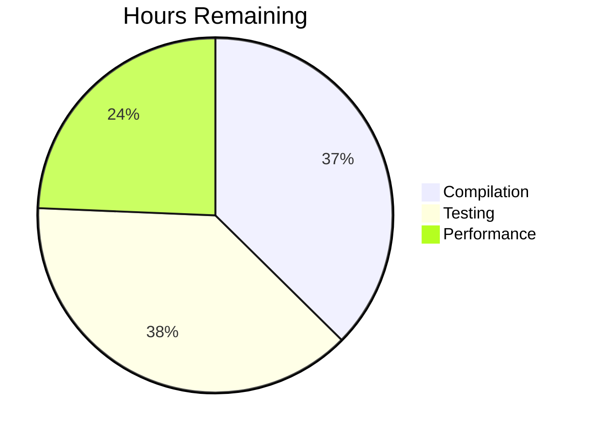

# CardDemo Assessment

## Status: 🔴 COMPILATION FAILED (100+ errors)

**Progress**: 65% complete - Architecture done, compilation blocked

### Accomplishments ✅
- Spring Boot microservices (143 files)
- PostgreSQL schema + Liquibase
- React frontend + JWT security
- Docker containerization

### Critical Issues 🔴
- Spring API compatibility (35 errors)
- Entity type mapping (25 errors)
- ValidationUtils signatures (20 errors)
- Missing DTO methods (15 errors)

### Tasks

**Next**: Fix compilation errors (48h)
**To Production**: 136 hours